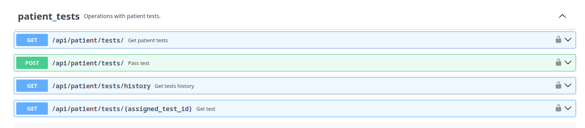

import { Steps } from "nextra/components";

# Adding a New Request

This guide will help you add a new request to the application to the backend.
Follow these steps to ensure that your new request is properly integrated and functional.

> [!NOTE]
>
> Before you start, make sure you have a basic understanding of how the `lib` is structured.
> Visit the [Understanding the `lib` structure](./lib-structure) article for more details.

In this guide it will be shown on example of adding a new service for managing `patient_tests`.

Here is how `patient-tests` look like in Swagger API:



## Step 1: Define the Service

To add a new request, you need to define a new class in the `lib/services` directory.

> [!NOTE]
>
> To maintain consistency and clarity in your codebase, please follow the naming conventions:
> 1. All files in this directory should end with `Service` (e.g. `PatientTestService.ts`).
> 2. Also corresponding service should be a class and receive an `AxiosInstance` in the constructor.

```ts filename="lib/services/PatientTestService.ts"
"use server";

import PatientTest from "@/schemas/PatientTest";
import PassTest from "@/schemas/PassTest";
import TestResultShort from "@/schemas/TestResultShort";
import {AxiosInstance} from "axios";

export default class PatientTestService {
    constructor(private readonly api: AxiosInstance) {}

    /**
     * The endpoint for the patient tests service.
     * This should match the path defined in your backend API.
     */
    endpoint = "/patient/tests";

    /**
     * This method retrieves all assigned tests for the patient.
     * <PatientTest[]> - generic type which indicates that the response will be an array of PatientTest objects.
     * this.endpoint - the endpoint URL for the API request. Matches the path defined in your backend API.
     * .then(res => res.data) - processes the response to return only the data part of the response.
     */
    getAssignedTests = () =>
        this.api.get<PatientTest[]>(this.endpoint).then(res => res.data);

    /** This method extends existing endpoint */
    getAssignedTestById = (assignedTestId: string) =>
        this.api.get<PatientTest>(`${this.endpoint}/${assignedTestId}`).then(res => res.data);

    /**
    * An example of a method that passes a test.
    * @param attempt - a JSON object containing the test attempt data.
    */
    passTest = (attempt: PassTest) =>
        this.api.post<TestResultShort>(this.endpoint, attempt).then(res => res.data);

    getTestsHistory = () =>
        this.api.get<TestResultShort[]>(`${this.endpoint}/history`).then(res => res.data);
}
```

> [!NOTE]
>
> If you need to define a type for the response, you can add it to the `schemas` directory.

## Step 2: Define the Controller

The controller is responsible for handling the requests and responses for the service you just created.

Defining a controller should be through `fetchPublic` or `fetchProtected` functions,
which are defined in the `lib/fetchers` module.

> [!NOTE]
>
> For more detailed info why to use `fetchProtected` and `fetchPublic`,
> see the [Defining Controller](./defining-controller) article.

Create a new file in the `lib/controllers` directory, for example, `PatientTestController.ts`:

```ts filename="lib/controllers/patientTestController.ts"
"use server";

import {fetchProtected} from "@/lib/fetchers";
import PatientTestService from "@/lib/services/PatientTestService";
import PassTest from "@/schemas/PassTest";

export const getAssignedTests = async () => fetchProtected(
    PatientTestService,
    service => service.getAssignedTests()
)

export const passTest = async (attempt: PassTest) => fetchProtected(
    PatientTestService,
    service => service.passTest(attempt)
)

export const getTestsHistory = async () => fetchProtected(
    PatientTestService,
    service => service.getTestsHistory()
)

export const getAssignedTestById = async (assignedTestId: string) => fetchProtected(
    PatientTestService,
    service => service.getAssignedTestById(assignedTestId)
)
```

## Step 3: Integrate with the Application

Now that you have defined the service and the controller, you need to integrate it into the application.

> [!WARNING]
>
> If you are changing cookies, you should know that they can be changed only in Client Components or in Route Handlers.
> If you try to change cookies in Server Components, it will raise an error.
>
> See the [Functions: cookies](https://nextjs.org/docs/app/api-reference/functions/cookies) in Next.js documentation for more details.

There is two ways how you can integrate your new service into the application:
with manually response handling or with `withSafeErrorHandling` higher-order function (HOF).

To see more information about fetching requests on client side and what is `withSafeErrorHandling`,
please visit the [Fetching on Client Side](./fetching-on-client-side) article.

<Steps>
### Directly fetching request and handling `ApiResponse`
```tsx filename="app/dashboard/patient/page.tsx"
"use server";

import {getAssignedTests} from "@/lib/controllers/PatientTestController";
import {ApiResponse} from "@/lib/api-client/types";
import PatientTest from "@/types/PatientTest";
import AssignedTestsPage from "@/app/features/.../AssignedTestsPage";

export default async function Page() {
    const assignedTestsResponse: ApiResponse<PatientTest[]> = await getAssignedTests();

    return (<AssignedTestsPage assignedTestsResponse={assignedTestsResponse} />);
}
```

### Fetching request with `withSafeErrorHandling` HOF

```ts filename="features/dashboard/patient/hooks/useAssignedTests.ts"
"use client";

import {getAssignedTests} from "@/lib/controllers/PatientTestController";
import useSWR from "swr";
import {withSafeErrorHandling} from "@/lib/fetchers/withSafeErrorHandling";

export default function useAssignedTests() {
    const {data, error, isLoading} = useSWR(
        "assigned-tests",
        withSafeErrorHandling(getAssignedTests)
    );

    return {
        assignedTests: data,
        isLoading,
        error
    };
}
```
</Steps>