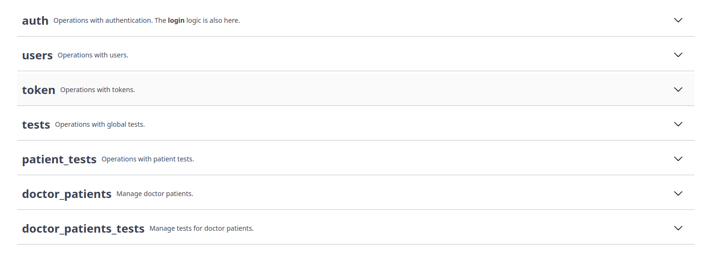

# Understanding the `lib` structure

The `lib` directory contains the core logic of the application.
Each service corresponds to a specific functionality or feature of the application.

- `lib/api-client` - contains functions to create axios instances, types for API responses, error handling, and defining SafeError.
- `lib/auth` - contains util functions for authentication or managing tokens.
- `lib/controllers` - contains controller functions that handle requests and responses for the services defined in `lib/services`. Has the same structure as Swagger API.
- `lib/fetchers` - contains functions for making requests to the backend, such as `fetchProtected` and `fetchPublic`, which are used to handle authentication and authorization.
- `lib/fetchers/withSafeErrorHandling` - a higher-order function (HOF) that wraps requests to handle errors safely and consistently.
- `lib/middleware` - contains middleware functions that can be used to redirect users based on their authentication status or roles.
- `lib/services` - contains service classes that define endpoints for interacting with the backend. Has the same structure as Swagger API.
- `lib/urls` - contains functions to get URLs for Route handlers.
- `lib/utils` - other utilities which are used in `lib` directory.

Some routes have the same structure as Swagger API,
which means that the directory structure and file names correspond to the API endpoints defined in Swagger.

Here is how endpoint groups look like in Swagger UI:



And here is how it looks like in the `lib/services` directory:

```
lib/services/PatientTestService.ts
lib/services/AnotherService.ts
lib/services/YetAnotherService.ts
```
