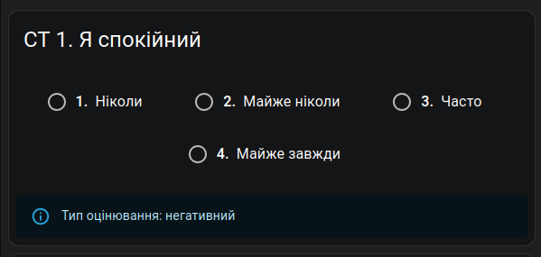
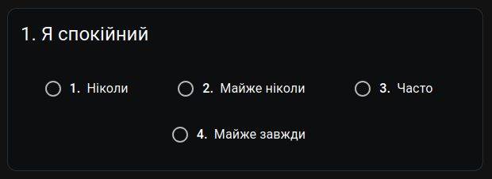
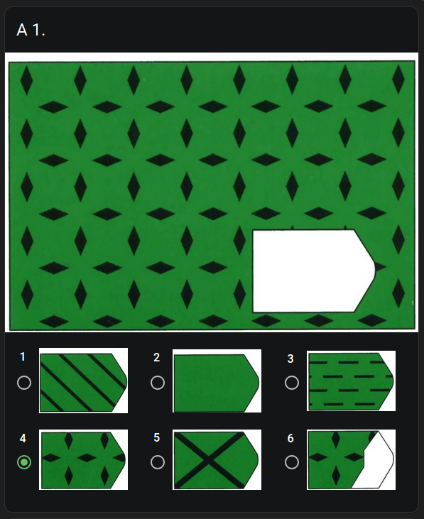
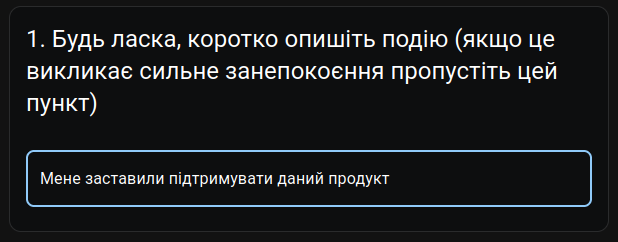

import {Steps} from "nextra/components";

# Creating a `QuestionCard` Component

In this section, you will learn how to create a `QuestionCard` component for your psychological test.

## What is a `QuestionCard`?

A `QuestionCard` is a reusable component that displays a question and its possible answers in a structured format.

It is used in psychological tests to present questions to the user and collect their responses.
Also, it used to display the question for the doctor with more detailed information.

Here is how `QuestionCard` may look like for a doctor:


And here is how it may look like for a patient:


`QuestionCard` can contain only images, text, or both.

Here is an example of a Raven's implementation of `QuestionCard` that contains only images:


Beside radio buttons, `QuestionCard` can also contain input fields for text answers.



## Creating a `QuestionCard` Component

In these steps it will be shown how to create a `QuestionCard` component based on STAI test.


<details>
<summary>
    Here is the context for the STAI test, which includes scales, answers, and questions.
</summary>

```ts filename="src/features/tests/STAITest/types/STAITest.ts"
export default interface STAITest extends TestBase {
    scales: STAIScale[];
    answers: STAIAnswer[];
    questions: STAIQuestion[];
}
```

```ts filename="src/features/tests/STAITest/types/STAIQuestion.ts"
export default interface STAIQuestion {
    id: string;
    question: string;
    scale: string | null;
    scoring_type: STAIScoringType | null;
}

export type STAIScoringType = "positive" | "negative";
````

```ts filename="src/features/tests/STAITest/types/STAIAnswer.ts"
export default interface STAIAnswer {
    name: string;
    mark: number | null;
}
```

```ts filename="src/features/tests/STAITest/types/STAIScale.ts"
export default interface STAIScale {
    id: string;
    name: string;
    description: string | null;
}
```

A real world example:

```json
{
  "scales": [
    {
      "label": "CT",
      "name": "Шкала ситуативної тривожності",
      "score_adjustment": 50
    },
    {
      "label": "OT",
      "name": "Шкала особистісної тривожності",
      "score_adjustment": 35
    }
  ],
  "answers": [
    {
      "name": "Ніколи",
      "mark": 1
    },
    {
      "name": "Майже ніколи",
      "mark": 2
    },
    {
      "name": "Часто",
      "mark": 3
    },
    {
      "name": "Майже завжди",
      "mark": 4
    }
  ],
  "questions": [
    {
      "id": "1",
      "question": "Я спокійний",
      "scale": "CT",
      "scoring_type": "negative"
    }
  ]
}

```

</details>

<Steps>

### Create the Component File

Let's create a new file for the `QuestionCard` component in the `src/features/tests/STAITest/components` directory.

> [!NOTE]
>
> You can pass different props to your component, the code snippet below is just an example.

```tsx filename="src/features/tests/STAITest/components/STAIQuestionCard.tsx"
import {QuestionCard} from "@/components/QuestionCard";

interface STAIQuestionCardProps {
    question: STAIQuestion;
    answers: STAIAnswer[];
    disabled?: boolean;
    index: number;
}

export default function STAIQuestionCard({
    question,
    answers,
    disabled = false,
    index
}: STAIQuestionCardProps) {
    return (
        <QuestionCard.Base>
        </QuestionCard.Base>
    );
}
```

### Fill `QuestionCard.Base` props and add `QuestionCard.Header`

For the `QuestionCard.Base` component, we need to provide the `index`, `moduleName`, and `header` props.

- The `index` prop is the index of the question in the test.
- The `moduleName` prop is the name of the scale (module), if applicable.
    In this case, backend can return `null` for a patient.
- The `header` prop is a component that will be displayed in the header of the card.
    We should use `QuestionCard.Header` component for this.
- The `footer` prop is optional and can be used to display additional information about the question.
    In this case, we will display the scoring type of the question.
    Backend returns `null` for a patient, so we skip checking a role.

```tsx filename="src/features/tests/STAITest/components/STAIQuestionCard.tsx" {6-13}
// ...

export default function STAIQuestionCard({answers, question, index, disabled}: STAIQuestionCardProps) {
    return (
      <QuestionCard.Base
          index={index}
          moduleName={question.scale ?? undefined}
          header={<QuestionCard.Header title={question.question}/>}
          footer={question.scoring_type ? (
              <Alert severity="info" sx={{width: "100%"}}>
                  Тип оцінювання: {question.scoring_type === "positive" ? "позитивний" : "негативний"}
              </Alert>
          ) : undefined}
      >
      </QuestionCard.Base>
  );
}
```

### Convert answers to appropriate format

Next, we need to convert the answers to the format that `QuestionCard.RadioButton` expects.
You can skip this if you are using different answers format.

> [!IMPORTANT]
>
> You should use `useMemo` hook to avoid unnecessary recalculations of the answers array.

```tsx filename="src/features/tests/STAITest/components/STAIQuestionCard.tsx" {6, 13-18}
import {useMemo} from "react";
import RadioAnswer from "@/components/QuestionCard/types/RadioAnswer";
// ...

export default function STAIQuestionCard({answers, question, index, disabled}: STAIQuestionCardProps) {
    const convertedAnswers = useMemo(() => convertAnswers(answers), [answers]);

    return (
        // ...
    );
}

const convertAnswers = (answers: STAIAnswer[]) => (
  answers.map((answer, index): RadioAnswer => ({
    answer: answer.name,
    value: index
  }))
);
```

### Add `QuestionCard.RadioButton`

Now we can add the `QuestionCard.RadioButton` component to display the answers.

```tsx filename="src/features/tests/STAITest/components/STAIQuestionCard.tsx" {17-20}
// ...

export default function STAIQuestionCard({answers, question, index, disabled}: STAIQuestionCardProps) {
    const convertedAnswers = useMemo(() => convertAnswers(answers), [answers]);

    return (
        <QuestionCard.Base
            index={index}
            moduleName={question.scale ?? undefined}
            header={<QuestionCard.Header title={question.question}/>}
            footer={question.scoring_type ? (
                <Alert severity="info" sx={{width: "100%"}}>
                    Тип оцінювання: {question.scoring_type === "positive" ? "позитивний" : "негативний"}
                </Alert>
            ) : undefined}
        >
            <QuestionCard.RadioButton
                answers={convertedAnswers}
                disabled={disabled}
            />
        </QuestionCard.Base>
    );
}

// ...
```

### Use newly created `QuestionCard` in the test content

Finally, we can use the newly created `QuestionCard` component in the test content.

```tsx filename="src/features/tests/STAITest/components/STAITestContent.tsx" {9-15}
import STAITest from "@/features/tests/STAITest/types/STAITest";
import STAIQuestionCard from "@/features/tests/STAITest/components/STAIQuestionCard";
import {TestInfoType} from "@/features/tests/TestConfig";

export default function STAITestContent({test, disabled}: TestInfoType<STAITest>) {
    return (
        <>
            {test.questions.map((question, index) => (
                <STAIQuestionCard
                    question={question}
                    answers={test.answers}
                    disabled={disabled ?? false}
                    index={index}
                    key={index}
                />
            ))}
        </>
    );
}
```

</Steps>