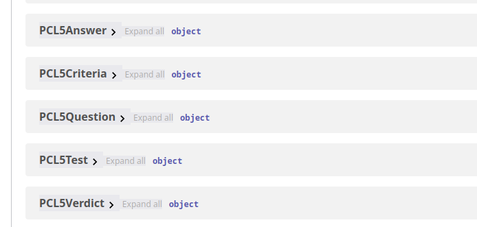

import {Steps} from "nextra/components";

# Implementing a Test

In this section, we will guide you through the process of implementing
a new psychological test in the application for the frontend.

> [!IMPORTANT]
>
> For a detailed guide on tests structure and configuration,
> refer to the [Tests Conventions](./tests-conventions) page.

<Steps>

## Create the Test Directory

Create a new directory for your test under `src/features/tests/` in the following format: `STAITest`.

## Create Types

Go to the Swagger documentation of the test you are implementing
and create the necessary types in the `types` directory of your test.

> [!NOTE]
>
> Instructions for creating types can be found in the
> [Extending `TestBase` and `TestResult`](./tests-conventions#extending-testbase-and-testresult)
> section of the Tests Conventions page.



## Create the Test Config

Create a `config.ts` file in your test directory and define the test configuration.

```ts filename="src/features/tests/STAITest/config.ts" copy
import TestConfigType from "@/features/tests/TestConfig";
import STAITest from "@/features/tests/STAITest/types/STAITest";
import STAIResult from "@/features/tests/STAITest/types/STAIResult";

const staiConfig: TestConfigType<STAITest, STAIResult> = {
    test: { },
    results: { }
}

export default staiConfig;
```

## Create the Test Components

Create the necessary components for your test in the `components` directory.
The components should include the test content, header, and any other necessary UI elements.

> [!NOTE]
>
> For more detailed instructions on creating components,
> refer to the [More about types and `TestConfigType`](./tests-conventions#more-about-types-and-testconfigtype)
> section of the Tests Conventions page.

> [!TIP]
>
> For creating QuestionCard component for your test,
> refer to the [Creating a `QuestionCard`](./creating-question-card)
> section of the Tests Conventions page.

```tsx filename="src/features/tests/STAITest/components/STAITestContent.tsx"
export default function STAITestContent({test, disabled}: TestInfoType<STAITest>) {
    return (
        <>
            {test.questions.map((question, index) => (
                <STAIQuestionCard
                    question={question}
                    answers={test.answers}
                    disabled={disabled ?? false}
                    index={index}
                    key={index}
                />
            ))}
        </>
    );
}
```

## Add Newly Created Components to the Config

Update the `config.ts` file to include the components you created.

```ts filename="src/features/tests/STAITest/config.ts"
import TestConfigType from "@/features/tests/TestConfig";
import STAITest from "@/features/tests/STAITest/types/STAITest";
import STAIResult from "@/features/tests/STAITest/types/STAIResult";
import STAITestContent, {STAITestHeader} from "@/features/tests/STAITest/layout/STAITestContent";
import STAIResultsContent from "@/features/tests/STAITest/layout/STAIResultsContent";

const staiConfig: TestConfigType<STAITest, STAIResult> = {
    test: {
        header: STAITestHeader,
        content: STAITestContent
    },
    results: {
        content: STAIResultsContent
    }
}

export default staiConfig;
```

## Add the Test to the Tests Configuration

Finally, add your test configuration to the main tests configuration file located at `src/features/tests/config.ts`.

```ts filename="src/features/tests/config.ts"
import staiConfig from "@/features/tests/STAITest/config";

const testsConfig: TestsConfigType = {
    stai: staiConfig,
    // other tests...
};
```

</Steps>