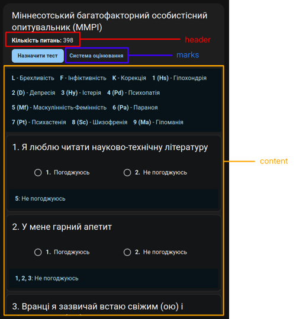
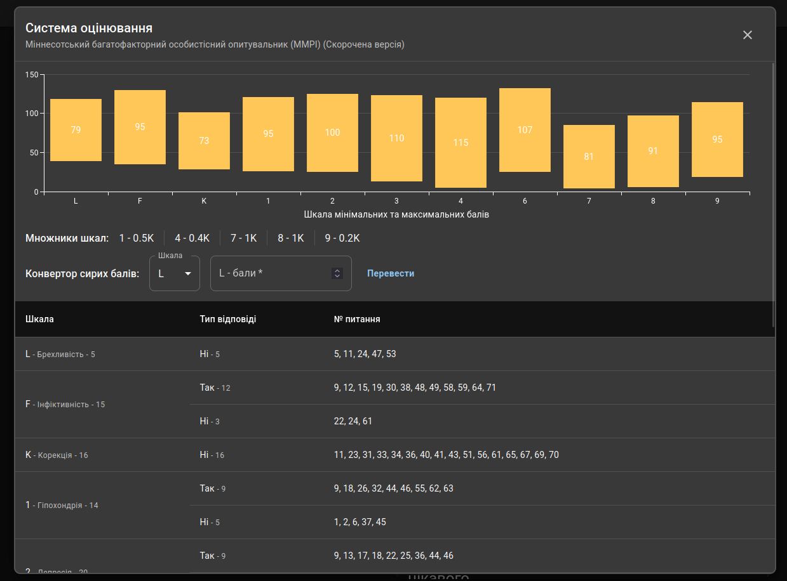
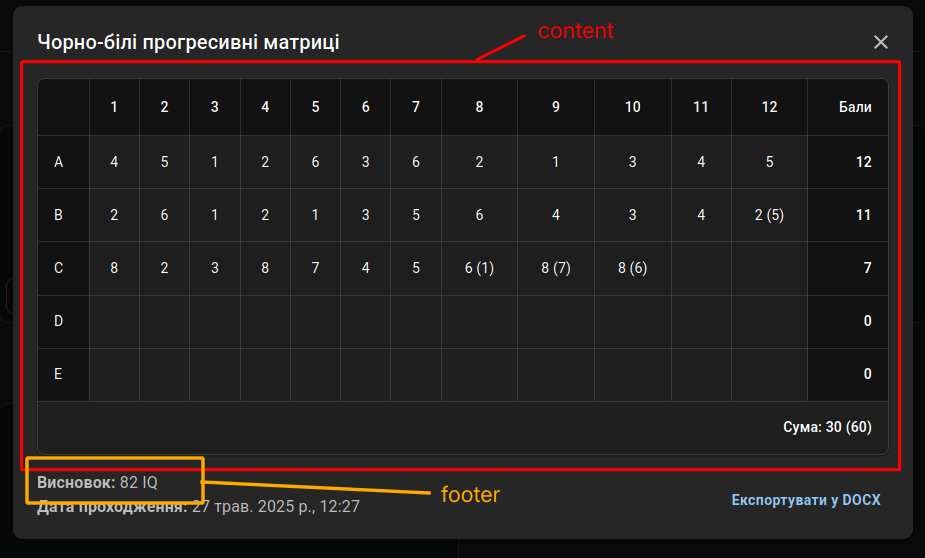
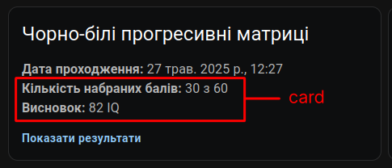

import {FileTree} from "nextra/components";

# Tests Conventions (Psychological Tests)

This provides an information about the conventions and structure of psychological tests in the application.

> [!NOTE]
>
> This page is not about software tests.
> It is about psychological tests that are implemented in the application.

## Tests structure

Logic for all tests is located in `src/features/tests/` directory.
For each test, there is a folder with the name of the test.

<FileTree>
    <FileTree.Folder name={"src/features/tests"} defaultOpen active>
        <FileTree.Folder name={"BDITest"}>...</FileTree.Folder>
        <FileTree.Folder name={"MMPITest"}>...</FileTree.Folder>
        <FileTree.Folder name={"PCL5Test"}>...</FileTree.Folder>
        <FileTree.File name={"config.ts"} active />
        <FileTree.File name={"TestConfig.ts"} />
    </FileTree.Folder>
</FileTree>

Each test should have a structure like it is in `features` pages.
Here is an example of the structure for the BDI test:

<FileTree>
    <FileTree.Folder name={"BDITest"} defaultOpen active>
        <FileTree.Folder name={"components"} defaultOpen>
            <FileTree.File name={"BDIQuestionCard.tsx"} />
        </FileTree.Folder>
        <FileTree.Folder name={"layout"} defaultOpen>
            <FileTree.File name={"BDIResultsContent.tsx"} />
            <FileTree.File name={"BDITestContent.tsx"} />
            <FileTree.File name={"BDITestHeader.tsx"} />
        </FileTree.Folder>
        <FileTree.Folder name={"types"} defaultOpen>
            <FileTree.File name={"BDIResult.ts"} />
            <FileTree.File name={"BDITest.ts"} />
        </FileTree.Folder>
        <FileTree.Folder name={"utils"} defaultOpen>
            <FileTree.File name={"getBDITestMetrics.ts"} />
        </FileTree.Folder>
        <FileTree.File name={"config.ts"} active />
    </FileTree.Folder>
</FileTree>

> [!IMPORTANT]
>
> Tests should not use logic from other tests (e.g. BDI test should not use logic from MMPI test.).
> However, this is allowed when a test extends another test (e.g. if MMPI Big extends MMPI test).

## Understanding config.ts

There are two config files:

- `src/features/tests/config.ts` - this file contains the configuration of all tests
- `src/features/tests/<TestName>/config.ts` - this file contains the component configuration for the specific test

Here is how the `config.ts` file looks like in `tests` directory.
It contains the list of all tests and their configurations.

```ts filename="src/features/tests/config.ts"
import TestConfigType from "@/features/tests/TestConfig";
import BDITest from "@/features/tests/BDITest/types/BDITest";
import BDIResult from "@/features/tests/BDITest/types/BDIResult";
import BDITestHeader from "@/features/tests/BDITest/layout/BDITestHeader";
import BDITestContent from "@/features/tests/BDITest/layout/BDITestContent";
import BDIResultsContent from "@/features/tests/BDITest/layout/BDIResultsContent";

/**
 * Configuration of all tests.
 * Add new tests here.
 */
const testsConfig: TestsConfigType = {
    raven: ravenConfig,
    mmpi: mmpiConfig,
    mmpi_big: mmpiConfig,
    "pcl-5": pcl5Config,
    bdi: bdiConfig,
    stai: staiConfig
};

export default testsConfig;
```

The `config.ts` file in the test folder contains the configuration for the specific test.
It contains various components that are used in the test.

Also in `TestConfigType` should be specified the type of the test and the type of the result.

```ts filename="src/features/tests/RavenTes/config.ts"
import TestContent, {TestHeader} from "@/features/tests/RavenTest/layout/TestContent";
import RavenTest from "@/features/tests/RavenTest/schemas/RavenTest";
import ResultsContent, {ResultsCard, ResultsFooter} from "@/features/tests/RavenTest/layout/ResultsContent";
import RavenResult from "@/features/tests/RavenTest/schemas/RavenResult";
import MarksContent from "@/features/tests/RavenTest/layout/MarksContent";
import TestConfigType from "@/features/tests/TestConfig";

const ravenConfig: TestConfigType<RavenTest, RavenResult> = {
    test: {
        header: TestHeader,
        content: TestContent,
        marks: MarksContent,
    },
    results: {
        content: ResultsContent,
        footer: ResultsFooter,
        card: ResultsCard,
    }
};

export default ravenConfig;
```

## More about types and `TestConfigType`

The `TestConfigType` is a generic type that defines the structure of the test configuration.

Here is how it looks like:

```ts filename="src/features/tests/TestConfig.ts"
import TestBase from "@/schemas/TestBase";
import TestResult from "@/schemas/TestResult";
import { ComponentType } from "react";
import {Role} from "@/schemas/Role";


export default interface TestConfigType<
    TTest extends TestBase,
    TTestResult extends TestResult<object | null>
> {
    test: {
        header: ComponentType<TestInfoType<TTest>>;
        content: ComponentType<TestInfoType<TTest>>;
        marks?: ComponentType<TestInfoType<TTest>>;
    },
    results: {
        content: ComponentType<{ test: TTestResult }>;
        footer?: ComponentType<{ test: TTestResult }>;
        card?: ComponentType<{ test: TTestResult }>;
    }
}

export interface TestInfoType<T extends TestBase> {
    test: T;
    role: Role;
    disabled?: boolean;
}
```

It's hard to understand it, right? Let's break it down:

- `TTest` and `TTestResult` are generic types that represent the test and the test result respectively.
    `TTest` says that the interface accepts only types that extend `TestBase`,
    and `TTestResult` accepts only types that extend `TestResult`.
- `test` shows the structure of the test component.
    It contains `header`, `content`, and optionally `marks`.
    Each of these is a React component that accepts `TestInfoType<TTest>` as props.
- `results` shows the structure of the results component.
    It contains `content`, `footer`, and optionally `card`.
    Each of these is a React component that accepts the test result as props.

### Extending `TestBase` and `TestResult`

When creating a new test, you need to extend `TestBase` and `TestResult` to create your own types.

For instance, for the BDI test, you would create `BDITest` and `BDIResult` types

```ts filename="src/features/tests/BDITest/types/BDITest.ts"
import TestBase from "@/schemas/TestBase";

export default interface BDITest extends TestBase {
    questions: BDIQuestion[];
}

export interface BDIQuestion {
    id: string;
    answers: BDIAnswer[];
}

export interface BDIAnswer {
    name: string;
    mark: number | null;
}
```

```ts filename="src/features/tests/BDITest/types/BDIResult.ts"
import TestResult from "@/schemas/TestResult";

type BDIResult = TestResult<BDIVerdict>;
export default BDIResult;

export interface BDIVerdict {
    total_score: number;
    verdict: string | null;
}
```

After that we should go to `TestBase.ts` and add test type to the `TestType` type:

```ts filename="src/schemas/TestBase.ts" /"bdi"/
// ...

export type TestType = "raven" | "mmpi" | "mmpi_big" | "pcl-5" | "bdi" | "stai";
```

### Components in `TestConfigType.test`

Here is a demonstration of what components stand for in `TestConfigType.test`:


Marks component is optional and can be used to display additional information about the test.
Marks system is displayed in explicit dialog only for a doctor.


All components in `TestConfigType.test` accept `TestInfoType<TTest>` as props.

#### Example of `TestConfigType.test`

```ts filename="src/features/tests/RavenTest/layout/MMPITestContent.tsx"
import MMPITest from "@/features/tests/MMPITest/schemas/MMPITest";
import { Typography} from "@mui/material";
import MMPIQuestionCard from "@/features/tests/MMPITest/components/MMPIQuestionCard";
import ScalesList from "@/features/tests/MMPITest/components/ScalesList";
import {Roles} from "@/schemas/Role";
import {TestInfoType} from "@/features/tests/TestConfig";

export const TestHeader = ({test}: TestInfoType<MMPITest>) => {
    const totalQuestions = test.questions.length;

    return (
        <Typography>
            <strong>Кількість питань:</strong> {totalQuestions}
        </Typography>
    );
};

export default function TestContent({test, role, disabled}: TestInfoType<MMPITest>) {
    return (
        <>
            {role !== Roles.patient && (
                <ScalesList scales={test.scales} />
            )}
            {test.questions.map((question, index) => (
                <MMPIQuestionCard
                    question={question}
                    key={`${test.id}/question/${index}`}
                    index={index}
                    disabled={disabled}
                    showScales={role !== Roles.patient}
                />
            ))}
        </>
    );
}
```

### Components in `TestConfigType.results`

Here is a dialog where passed test results are displayed.

In center of the dialog is the `content` component, which is used to display the main results of the test.
The `footer` component is used to display additional information about the test.



The `card` component is used to display the results of the test in a card before the dialog is opened.



All components in `TestConfigType.results` accept `{ test: TTestResult }` as props.

#### Example of `TestConfigType.results`

```ts filename="src/features/tests/RavenTest/layout/ResultsContent.tsx"
import ResultsTable from "@/features/tests/RavenTest/components/ResultsTable";
import TestValues from "@/components/TestValues";
import countCorrectAnswers from "@/features/tests/RavenTest/utils/countCorrectAnswers";
import RavenResult from "@/features/tests/RavenTest/schemas/RavenResult";

interface ResultsProps { test: RavenResult; }

export default function ResultsContent({test}: ResultsProps) {
    return test.verdict && (
        <ResultsTable results={test.verdict.results} />
    );
}

export const ResultsFooter = ({test}: ResultsProps) => {
    return test.verdict?.verdict && (
        <TestValues title={"Висновок"}>
            {test.verdict.verdict} {test.test.marks_unit}
        </TestValues>
    );
}


export const ResultsCard = ({test}: ResultsProps) => {
    const verdict = test.verdict;

    const {correctPoints, totalPoints} = verdict
        ? countCorrectAnswers(verdict.results)
        : {correctPoints: 0, totalPoints: 0};

    return (
        <>
            <TestValues title={"Кількість набраних балів"}>{correctPoints} з {totalPoints}</TestValues>
            {verdict && (
                <TestValues title={"Висновок"}>{verdict.verdict} {test.test.marks_unit}</TestValues>
            )}
        </>
    );
}
```